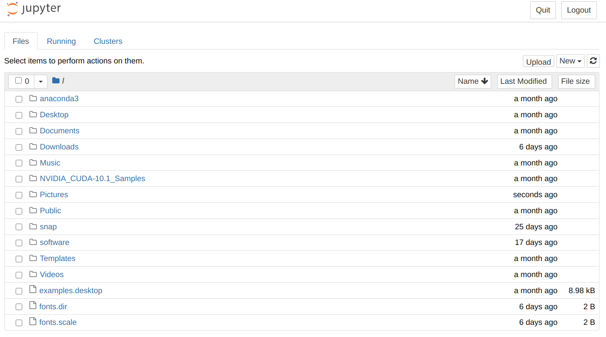
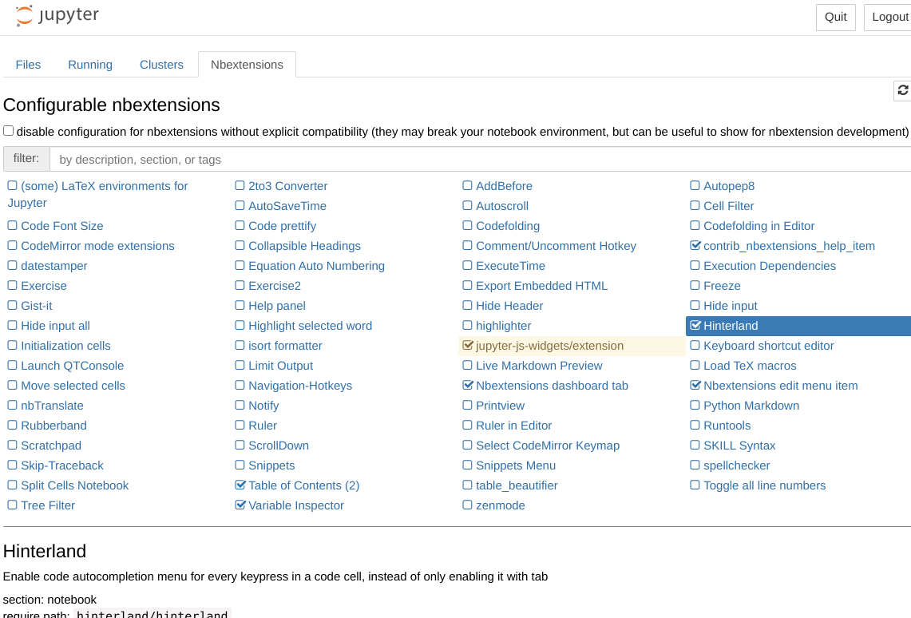

# jupyter notebook 的一些基本配置

juyter notebook 的安装、同步虚拟环境以及插件

jupyter notebook 是一个非常好用的工具。

#### 1. 安装

Anaconda 自带 jupyter notebook，若没有，只需运行
```shell
conda install jupyter notebook
```

如果使用的是pip，则运行
```shell
# python3.x版本的pip，python2.x版本只需使用pip或者pip2
pip3 install --upgrade pip 
pip3 install jupyter
```

安装完成后运行 `jupyter notebook` 就会打开一个网页，如下图所示，这样就成功了。



#### 2. 虚拟环境同步

一般来说，在使用python时我们会创建不同的虚拟环境来进行不同的工作，但是默认的jupyter notebook
只有一个kernel，没有虚拟环境的kernel。要将虚拟环境的python也加入到jupyter notebook中，
有一下两种方式：

1. 使用conda
在虚拟环境中安装 `nb_conda` 插件
```shell
conda install nb_conda
```
如果需要这个环境的python，就先进入这个环境中，然后运行 `jupyter notebook`

2. 通用型，不是anaconda用户也可以实现

首先进入虚拟环境
Anaconda 用户
``` shell
conda activate myenv
```

非Anaconda用户，`myenv_path` 是虚拟环境的安装路径
```shell
source myenv_path/bin/activate
```

将虚拟环境的python kernel加入jupyter notebook中
```shell
pip install ipykernel
python -m ipykernel install --user --name=myenv
```

通过这种方式添加的kernel会放在 `~/.local/share/jupyter/kernels/` 里面。

#### 3. 插件

安装 jupyter_contrib_nbextensions 所有插件
``` shell
pip install jupyter_contrib_nbextensions # pip2或pip3
jupyter contrib nbextension install --user
```

安装 Jupyter Nbextensions Configurator 插件配置器
```shell
pip install jupyter_nbextensions_configurator
jupyter nbextensions_configurator enable --user
```

安装完成后打开 jupyter notebook 就可以看到多了一项 `Nbextensions`，如下图：



常用插件
`Hinterland`: 补全插件；
`Table of Contents (2)`: 自动生成目录插件，给 notebook 中的 markdown 文本自动生成目录；
`Variable Inspector`: 查看变量，可以查看变量名、类型，大小，形状和值，大致
相当于matlab右侧的变量区。

<br>
<br>
<br>

> 关于 jupyter notebook 的另一部分内容：[本地远程连接服务器的jupyter notebook](https://jintaolee-roger.github.io/jekyll/update/2020/09/27/jupyter-remote.html)
